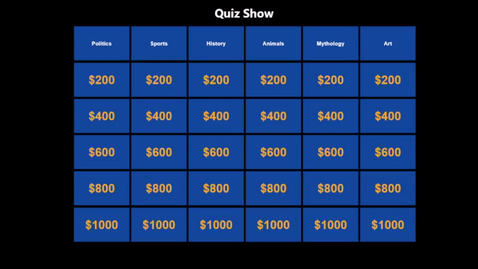

## Flet Jeopardy

This repository supports a walkthrough be published on 
my [YouTube Channel @CodingJQ](https://youtu.be/tvysK9zWbIM).

I hope you find it helpful to learn how to set up an interactive Jeopardy-style board in Flet!

)

Special thanks to https://opentdb.com for the quiz questions.
